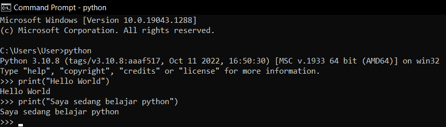
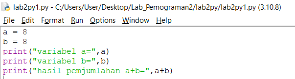

# PROSES / LANGKAH-LANGKAH PRATIKUM

## LATIHAN 1

### - Menjalankan tulisan "Hello" dilayar
### - Menampilkan tulisan "Saya sedang belajar python" dilayar

## LATIHAN 2

### - Menjumlahkan dua buah variabel bilangan menggunakan variabel a dan b
####   - Mendenifisikan variabel a dengan nilai 8
####   - Mendenifisikan variabel b dengan nilai 6
####   - Mencetak nilai variabel a dan b 
####   - Mencetak hasil penjumlahan a+b

